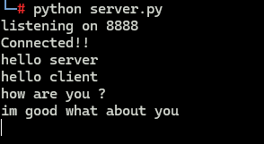
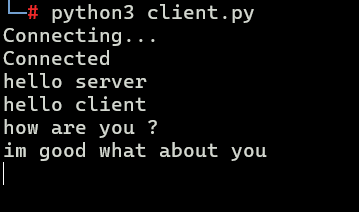

# Python Socket Chat Application 💬

A simple **client-server chat application** built in Python using **Socket Programming** and **Multithreading**.

This project allows a client and server to communicate with each other in real time. Separate threads are used for sending and receiving messages simultaneously.

## Features

* Client-server communication using TCP sockets
* Real-time message sending and receiving
* Multithreading for simultaneous send/receive operations
* Simple command-line interface
* Uses Python's built-in `socket` and `threading` modules

## Project Structure

```text
.
├── client.py
├── server.py
├── images/
│   ├── client.png
│   └── server.png
└── README.md
```

## Technologies Used

* **Python**
* **Socket Programming**
* **TCP/IP**
* **Multithreading**

##  How to Run

### 1. Start the server

Open a terminal and run:

```bash
python server.py
```

The server will start listening on:

```text
127.0.0.1:8888
```

### 2. Start the client

Open another terminal and run:

```bash
python client.py
```

Once connected, you can type messages in either terminal and communicate between the client and server.

## 📸 Screenshots

### Server



### Client



## How It Works

Both the client and server use two main operations:

* **`send_msg()`** — continuously takes user input and sends it through the socket.
* **`recv_msg()`** — continuously receives messages from the other side and displays them.

A separate thread is created for sending messages, allowing the program to receive messages at the same time without blocking user input.

```python
t1 = threading.Thread(target=send_msg)
t1.start()

recv_msg()
```

## Note

This is a basic learning project demonstrating how **TCP sockets and threads** can be combined to build a simple real-time chat application.'
#### Thanks to @Hellsender01 for guidance  
